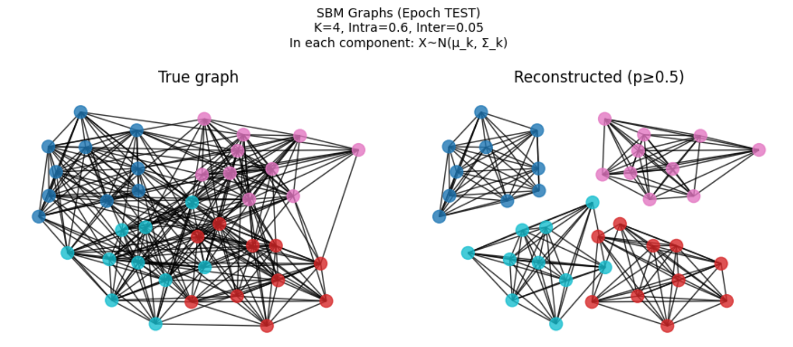

# Probabilistic Graph Forecasting with Autoregressive Decoders

## Overview
This repository implements a temporal latent-variable model for forecasting sequences of graphs \( \{G_t\}_{t=1}^T \) where each \( G_t = (X_t, A_t) \) consists of node features \( X_t \) and adjacency matrix \( A_t \). Drawing from variational autoencoder principles with an autoregressive twist, the model captures probabilistic dynamics in graph evolution—ideal for scenarios like social networks, traffic systems, or molecular interactions. With a probabilistic lens, we estimate future graphs by sampling from learned latent trajectories, acknowledging inherent uncertainties in complex systems.

## Process Description
The implementation unfolded in a structured, step-by-step manner akin to Bayesian inference: building priors (components) before updating with evidence (integration and training).

1. **Synthetic Dataset Generation**: Created a dynamic graph dataset using Stochastic Block Models (SBM) for community-structured adjacencies, Gaussian node features with temporal drifts, and edge flips for smooth evolution. This simulates realistic graph sequences for training.

2. **Model Components**:
   - **Encoder**: A simple graph encoder aggregating node features and degrees to infer latent \( Z_t \).
   - **Transition Prior**: An MLP-based Gaussian prior for autoregressive latent evolution \( p(Z_{t+1} | Z_t) \).
   - **Decoder**: Probabilistic reconstruction of node features (Gaussian) and edges (Bernoulli) from \( Z_t \).

3. **Utilities**: Defined reparameterization, KL divergence, and negative log-likelihoods for Gaussian/Bernoulli distributions to enable variational training.

4. **Full Model (TemporalGraphVAE)**: Integrated components into a VAE with time-factorized ELBO, supporting inference, reconstruction, and future generation.

5. **Visualization Helpers**: Functions to plot true vs. reconstructed graphs, highlighting community structures.

6. **Training Loop**: Optimized the model over epochs with KL annealing, loss tracking, and periodic visualizations.

7. **Testing/Evaluation**: Assessed reconstructions on held-out sequences, computing edge accuracy and displaying visual comparisons.

## Usage
1. Generate dataset: `dataset = SyntheticGraphDataset(...)`
2. Initialize model: `model = TemporalGraphVAE(...)`
3. Train: `trained_model = train_model(model, dataset, ...)`
4. Test: `test_model(trained_model, dataset)`

## Results
<p align="center">
    
</p>

```
Sample 3 | Edge Accuracy: 0.8282
```

<p align="center">
    
</p>

```
Sample 4 | Edge Accuracy: 0.8936
```
